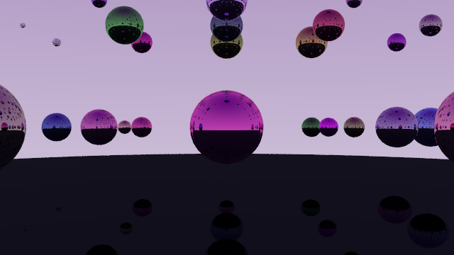
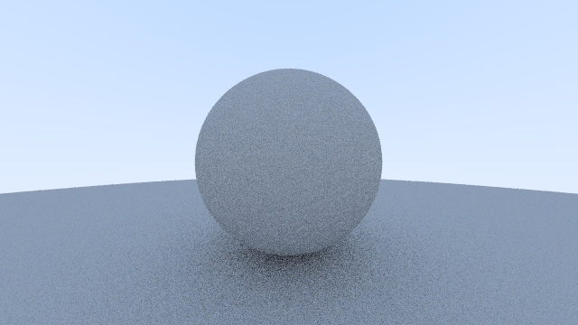

# raytracer

Implements a raytracer based on the book [_Ray Tracing in One Weekend_](https://raytracing.github.io/books/RayTracingInOneWeekend.html). Examples are provided at the end of Readme.md
- **materials**: matte objects, metals, dielectrics
- **shaders**: lambertian shading, phong shading 
- **shapes**: spheres, boxes, planes
- **extras**: custom air color change



## How to build

*Windows*

Open git bash to the directory containing this repository.

```
raytracer $ mkdir build
raytracer $ cd build
raytracer/build $ cmake -G "Visual Studio 16 2019" ..
raytracer/build $ start CS312-Raytracer.sln
```

Your solution file should contain multiple projects, such as `gradient` and `normals`.
To run from the git bash command shell, 

```
raytracer/build $ ../bin/Debug/gradient
raytracer/build $ ../bin/Debug/normals
```

*macOS*

Open terminal to the directory containing this repository.

```
raytracer $ mkdir build
raytracer $ cd build
raytracer/build $ cmake ..
raytracer/build $ make
```

To run each program from build, you would type

```
raytracer/build $ ../bin/gradient
raytracer/build $ ../bin/normals
```

## Demos from class


## Basic raytracer



## Air color change feature
Air color could be set and customized in ```main.cpp``` for the entire scene.

Before:


After:


## My demo


